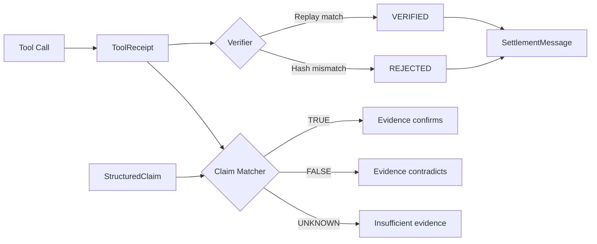

# TRP — Tool Receipt Protocol

**Verifiable tool call accountability for AI agents.**

[](https://github.com/Spudbe/trp-core/actions)
[](LICENSE)
[](https://python.org)

Every tool call produces a signed, hash-verified receipt. Claims are structured propositions mechanically matched to receipt evidence. Verification is deterministic — no LLM judge required.

[Live Demo](https://trp-core-production.up.railway.app) · [Spec](SPEC.md) · [Case Study: OpenClaw](docs/OPENCLAW_CASE_STUDY.md)

## Quickstart

```bash
pip install trp-core
```

```python
from trp import ToolReceipt, ToolReceiptVerifier
from trp.deterministic_tools import BUILTIN_TOOLS

# Create a receipt for a tool call
receipt = ToolReceipt(
    receipt_id="", tool_name="compute_fibonacci", tool_version="1.0.0",
    provider_name="my_app", provider_id="local", protocol_family="local_python",
    started_at="2026-03-23T00:00:00Z",
    input_inline={"n": 10},
    output_inline={"input": 10, "result": 55, "algorithm": "iterative"},
)

# Verify by replaying the tool
verifier = ToolReceiptVerifier()
for name, fn in BUILTIN_TOOLS.items():
    verifier.register(name, fn)

result = verifier.verify(receipt)
print(result.status)  # verified_exact
```

## CLI

```bash
trp verify examples/fibonacci_receipt.json
trp match examples/structured_claim.json examples/fibonacci_receipt.json
trp hash examples/fibonacci_receipt.json
```

## How It Works



## Add Receipts to MCP Tool Calls

```python
from trp.mcp_adapter import wrap_tool_call

# In your MCP server's tool handler:
def handle_tool_call(name, inputs):
    output = my_tool(inputs)
    receipt = wrap_tool_call(
        tool_name=name,
        tool_version="1.0.0",
        inputs=inputs,
        output=output,
        nondeterminism="deterministic",
        side_effects="none",
        replay="strong",
    )
    return {"result": output, "_meta": {"trp:tool_receipt": receipt.to_dict()}}
```

## REST API

```bash
# Verify a receipt
curl -X POST https://trp-core-production.up.railway.app/api/verify \
  -H "Content-Type: application/json" \
  -d @examples/fibonacci_receipt.json

# Match a claim against evidence
curl -X POST https://trp-core-production.up.railway.app/api/match \
  -H "Content-Type: application/json" \
  -d '{"claim": ..., "evidence": [...]}'

# Compute JCS canonical hash
curl -X POST https://trp-core-production.up.railway.app/api/hash \
  -H "Content-Type: application/json" \
  -d '{"n": 10}'
```

## What TRP Is

A message protocol that lets agents make claims, attach proofs, and stake value on correctness. Other agents evaluate, challenge, or accept claims, and settlement redistributes stakes. TRP defines message shapes and interaction flow — it does not prescribe transport, identity, or proof format.

## How It Fits

Where MCP handles tool invocation and A2A handles agent discovery, TRP handles claim accountability. An agent that retrieves data via MCP or delegates work via A2A can use TRP to attach a verifiable proof and an economic stake to the result.

## Core Types

| Type | Purpose |
|------|---------|
| `ToolReceipt` | Signed, hash-verified record of a tool call |
| `StructuredClaim` | Machine-parseable proposition linked to evidence |
| `EvidenceBundle` | Composite package of receipts + document hashes + attestations |
| `ToolReceiptVerifier` | Replay engine — re-runs tools and compares output hashes |
| `TRPMessage` | Versioned protocol envelope |
| `SettlementMessage` | Stake redistribution record |
| `AgentCapability` | Discovery declaration (served at `/.well-known/trp-capability.json`) |

## License

Apache-2.0. See [LICENSE](LICENSE).
