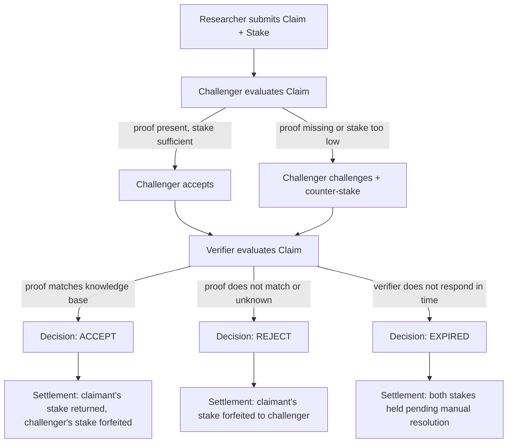

# Architecture

## Overview

URP is structured as four layers: message, agent, ledger, and transport. The message layer defines the envelope format and the four core data types (Claim, ProofReference, Stake, Response). The agent layer provides an abstract base class and three reference implementations that produce and evaluate claims. The ledger layer tracks credit balances and manages stake escrow. The transport layer moves serialised URPMessage envelopes between agents over the network. Each layer depends only on the layers below it, and any layer can be replaced independently — a production deployment would likely replace the ledger and transport layers while keeping the message and agent interfaces intact.

## Claim Lifecycle

## Layer Breakdown

### Message Layer

`urp/message.py` defines the `URPMessage` class, which wraps any protocol payload (Claim or Response) in a standard envelope. The envelope carries a `protocol_version` field (currently `"0.3.0"`), a UUID `message_id`, an ISO 8601 `timestamp`, the `sender` identifier, a `type` string (`"claim"` or `"response"`), and the serialised `payload`. Serialisation uses `to_json()` which delegates to the payload's `to_dict()` method, falling back to `dataclasses.asdict()`. Deserialisation via `from_json()` requires the caller to pass the payload class so the envelope can reconstruct the correct type.

The four core data types live in `urp/core.py`: `Claim`, `ProofReference`, `Stake`, and `Response`. All are dataclasses with explicit `to_dict()` and `from_dict()` methods. `ClaimType` and `Decision` are string enums that map directly to the JSON schema values.

### Agent Layer

`urp/agent.py` defines an abstract `Agent` base class with two methods: `create_claim(query) -> Claim` and `evaluate_claim(claim) -> Response`. Three concrete implementations exist:

- **ResearcherAgent** — Creates claims by looking up a query in the knowledge base and attaching the result as a proof summary. Does not evaluate other agents' claims.
- **ChallengerAgent** — Evaluates claims by checking whether a proof reference exists and whether the stake meets a minimum threshold. Challenges claims that fail either check; accepts otherwise.
- **VerifierAgent** — Makes final decisions by comparing the claim's proof summary against the knowledge base. Accepts if they match; rejects otherwise.

The knowledge base itself is abstracted behind a `KnowledgeBase` ABC in `urp/knowledge_base.py`, with `InMemoryKnowledgeBase` as the default implementation. The module-level `get_fact()` function provides backwards compatibility.

### Ledger Layer

`urp/ledger.py` provides an in-memory `Ledger` dataclass that tracks agent balances as a `Dict[str, float]`. It supports `deposit()`, `withdraw()`, `transfer()`, and `get_balance()` operations. Withdrawals fail with a `ValueError` if the agent has insufficient funds.

The current ledger does not track: stake escrow (stakes are managed by simulation logic, not the ledger itself), transaction history, multi-currency support, or atomicity guarantees. A production ledger would need persistent storage, atomic stake locking tied to claim lifecycle events, an audit log, and either a smart contract backend or a double-entry accounting system.

### Transport Layer

`urp/transport.py` implements a WebSocket-based transport using the `websockets` library. `AgentServer` wraps an Agent instance and listens for incoming JSON messages on a configurable port. When it receives a message with `type: "claim"`, it deserialises the payload, calls `evaluate_claim()`, and sends back a Response envelope. `AgentClient` opens a connection to a target URI, sends a single URPMessage, and waits for one reply.

The transport layer is the most likely candidate for replacement. Two adapter paths are described in SPEC.md:

- **MCP transport adapter** — wraps URP operations as MCP tool calls (urp_submit_claim, urp_challenge_claim, urp_verify_claim, urp_settle_claim, urp_get_capability). Any MCP-connected agent can participate in the URP claim lifecycle without a direct WebSocket connection.
- **A2A transport adapter** — maps URP claims to A2A tasks and responses to task artifacts. A2A's signed agent cards can carry AgentCapability declarations for capability discovery before claim submission.

Both adapters are spec-only and not yet implemented. The agent and message layers would not change regardless of which transport is used.

## What URP Does Not Cover

- **Proof format** — URP requires a hash and a URI but does not define what the proof contains or how it is structured. Proof format standardisation depends on the types of claims agents will make, which are not yet known.
- **Agent identity** — Agents are identified by a plain string name. There is no authentication, no DID resolution, and no key registry. Identity requires decisions about decentralisation and trust anchors that are premature at this stage.
- **Message signing** — The spec describes a JWS-based signing model but the implementation does not enforce it. Signing depends on the identity layer, which is also deferred.
- **Transport security** — WebSocket connections are unencrypted and unauthenticated. TLS and mutual authentication are standard engineering work but are not the focus of the protocol design.
- **Governance** — There is no process for proposing or ratifying spec changes. Governance mechanisms require a community of implementers, which does not yet exist.

## Reference Implementation Notes

The code in `urp/` is a prototype for validating the protocol design. It uses dummy proof hashes, an in-memory knowledge base with three hard-coded facts, and a ledger with no persistence. Settlement logic lives in the simulation scripts rather than in the ledger, so stake escrow is implicit rather than enforced. The WebSocket transport has no error recovery, reconnection, or backpressure handling. A production implementation would need real cryptographic hashes in ProofReference, a pluggable knowledge base with external data sources, a persistent ledger with atomic stake operations, authenticated transport with TLS, and message signing as described in the spec's signing model stub.
